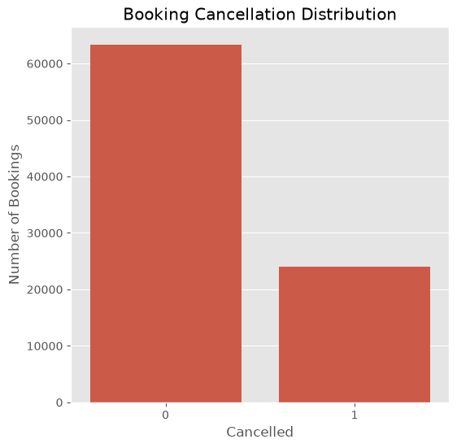
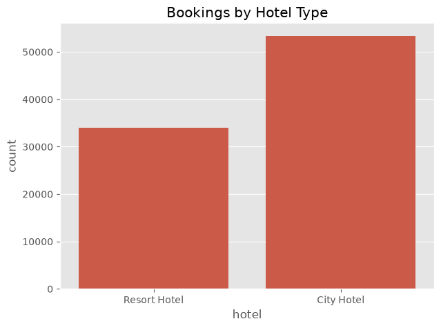
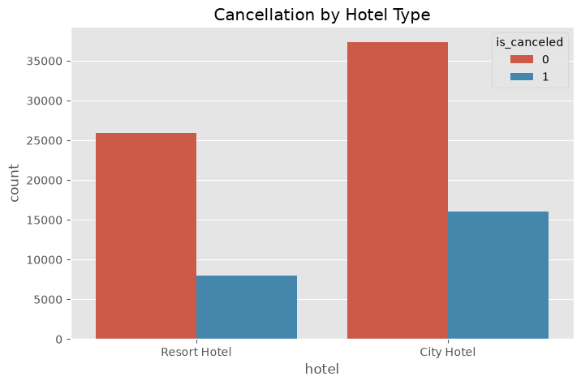
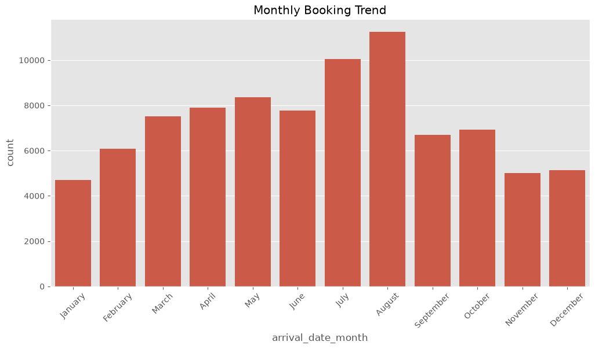
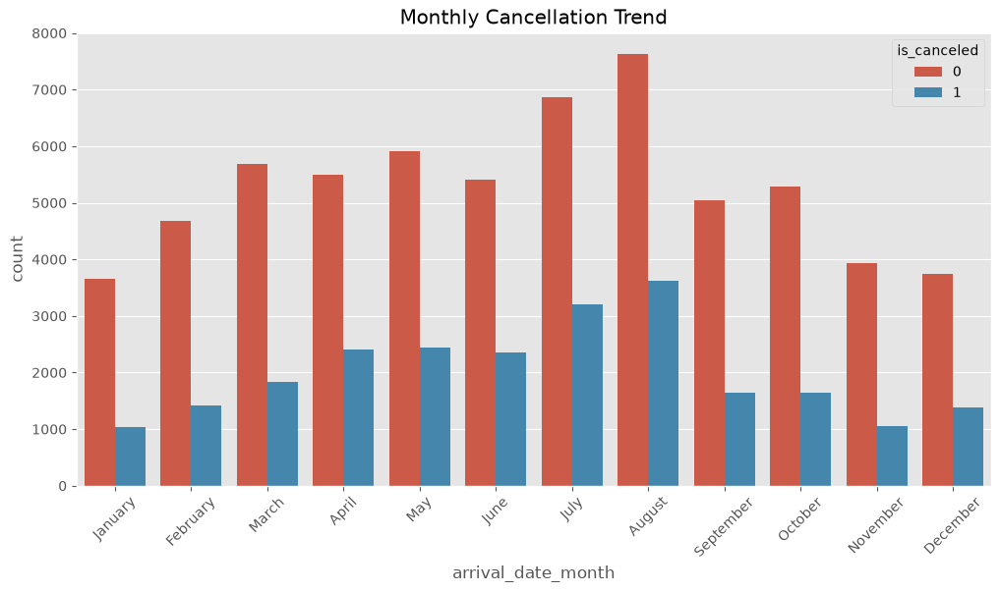

# Hotel Booking Analytics and Cancellation Prediction

## Machine Learning Practical Assignment

**Team Information:**
- **Member 1 Name:** Anurag
- **Roll No:** CSJMA23001390009
- **Contribution:** Dataset and data cleaning part.

- **Member 2 Name:** Ankit Kumar
- **Roll No:** CSJMA2300139005
- **Contribution:** Implemented the full pipeline.

- **Member 3 Name:** 
- **Roll No:** 
- **Contribution:** 

---

##  Project Overview

This ML project develops a data-driven decision-support system for hotel booking analytics.

- Data Cleaning
- Exploratory Data Analysis (EDA)
- Feature Engineering
- Machine Learning
- Model Evaluation
- Feature Importance Analysis
- Power BI Business Intelligence Dashboard
- Business Insights and Recommendations

The objective is to analyze historical hotel booking data, identify important cancellation patterns, and develop a machine learning model that can predict whether a booking is likely to be cancelled.

---

##  Project Objectives

The main objectives of the project are:

1. Clean and prepare the hotel booking dataset.
2. Explore booking and cancellation patterns.
3. Engineer meaningful analytical features.
4. Identify important factors associated with cancellation prediction.
5. Develop and compare multiple machine learning classification models.
6. Tune selected machine learning models.
7. Select a final predictive model based on evaluation results.
8. Develop an interactive Power BI dashboard.
9. Translate analytical findings into actionable business recommendations.

---

##  Dataset

The project uses the **Hotel Booking Demand** dataset.

The dataset contains booking information from two hotels:

- City Hotel
- Resort Hotel

The target variable is:

`is_canceled`

where:

- `0` = Booking was not cancelled
- `1` = Booking was cancelled

The cleaned dataset contains:

- 87,377 booking records
- 24,024 cancelled bookings
- 63,353 completed bookings
- 27.49% overall cancellation rate

The original dataset is available from Kaggle:

https://www.kaggle.com/datasets/jessemostipak/hotel-booking-demand

---

## Data Preparation

The data preparation process included:

- Duplicate detection and removal
- Missing-value treatment
- Data type validation
- Feature selection
- Data consistency checks

A total of 32,013 duplicate records were removed from the original dataset.

The dataset was reduced from:

`119,390 records`

to:

`87,377 records`

after duplicate removal.

---

## Feature Engineering

Additional analytical features were created to improve business analysis and machine learning.

Examples include:

- `total_nights`
- `total_guests`
- `estimated_revenue`
- `arrival_month_num`
- `season`
- `booking_size`
- `stay_category`
- `lead_time_category`

These features support both the Power BI analysis and the machine learning workflow.

---

## Exploratory Data Analysis (EDA) Highlights

Below are a selection of important data visualization graphs generated during the Exploratory Data Analysis phase:

---

## Machine Learning

The project treats cancellation prediction as a binary classification problem.

The following models were evaluated:

1. Logistic Regression
2. Decision Tree
3. Random Forest
4. Gradient Boosting

The models were evaluated using:

- Accuracy
- Precision
- Recall
- F1 Score
- ROC-AUC

---

## Baseline Model Results

The latest baseline model results are:

| Model | Accuracy | Precision | Recall | F1 | ROC-AUC |
|---|---:|---:|---:|---:|---:|
| Logistic Regression | 82.72% | 77.23% | 68.08% | 72.36% | 89.40% |
| Decision Tree | 84.07% | 75.61% | 76.82% | 76.21% | 82.38% |
| Random Forest | **88.37%** | **87.36%** | **75.99%** | **81.28%** | **94.49%** |
| Gradient Boosting | 86.45% | 84.36% | 72.70% | 78.10% | 93.37% |

Based on the latest baseline evaluation, **Random Forest was selected as the final model**.

---

## Model Tuning

RandomizedSearchCV was used to tune:

- Gradient Boosting
- Random Forest

The latest tuned results were:

| Model | Accuracy | Precision | Recall | F1 | ROC-AUC |
|---|---:|---:|---:|---:|---:|
| Tuned Gradient Boosting | 83.88% | 74.59% | 62.75% | 68.16% | 90.01% |
| Tuned Random Forest | 83.51% | 79.01% | 54.53% | 64.52% | 90.05% |

The tuned results were compared against the baseline models before selecting the final model.

---

## Final Model

The current final selected model is:

**Random Forest**

Latest evaluation:

- Accuracy: **88.37%**
- Precision: **87.36%**
- Recall: **75.99%**
- F1 Score: **81.28%**
- ROC-AUC: **94.49%**

The trained model is stored as:

`hotel_cancellation_model.pkl`

---

##  Feature Importance

The Random Forest model identified the following features as the most important predictive features:

| Rank | Feature | Importance |
|---:|---|---:|
| 1 | Lead Time | 10.49% |
| 2 | Arrival Year | 8.41% |
| 3 | ADR | 7.50% |
| 4 | Total Special Requests | 4.89% |
| 5 | Arrival Day of Month | 4.87% |
| 6 | Arrival Week Number | 4.44% |
| 7 | Country PRT | 4.27% |
| 8 | Total Nights | 3.43% |
| 9 | Weeknight Stays | 3.13% |
| 10 | Required Car Parking Spaces | 3.11% |

Feature importance represents predictive contribution within the model and should not be interpreted as proof of causation.

---

##  Power BI Dashboard

The project includes a Power BI decision-support dashboard consisting of five analytical pages.

### Page 1 — Executive Overview

Provides a high-level overview of hotel booking performance and key business KPIs.

### Page 2 — Cancellation Analysis

Analyzes cancellation patterns across booking characteristics such as lead time, hotel type, market segment, and deposit type.

### Page 3 — Revenue & Booking Performance

Focuses on ADR, estimated revenue, stay length, and booking performance.

### Page 4 — Customer & Market Intelligence

Analyzes customer types, countries, repeat guests, and market behavior.

### Page 5 — Predictive Analytics

Presents:

- Final model KPIs
- Model comparison
- Tuned model comparison
- Feature importance
- Predictive analytics findings

---

##  Key Business Insights

The analysis identified several important patterns.

### Lead Time

Bookings made further in advance show higher cancellation rates.

Bookings with a lead time of 91+ days had approximately a 36.8% cancellation rate.

### Hotel Type

City Hotel showed a higher cancellation rate than Resort Hotel.

- City Hotel: approximately 30.04%
- Resort Hotel: approximately 23.49%

### Market Segment

Online Travel Agency bookings represented a major portion of the dataset and showed a relatively high cancellation rate.

### Repeat Guests

Repeat guests showed a substantially lower cancellation rate compared with new guests.

### ADR

Cancelled bookings had a higher average ADR than completed bookings in the analyzed dataset.

### Deposit Type

The Non Refund category showed an unusually high cancellation rate and should be investigated carefully because this may reflect a particular recording or business-policy convention.

---

##  Business Recommendations

Based on the analysis, hotels can consider:

1. Prioritizing monitoring of long-lead bookings.
2. Using predictive cancellation risk to support reservation management.
3. Reviewing cancellation behavior within Online Travel Agency channels.
4. Investigating the business rules behind Non Refund bookings.
5. Encouraging repeat-customer relationships.
6. Monitoring financial impact in addition to cancellation counts.
7. Using arrival-date-level analysis to support inventory and overbooking decisions.